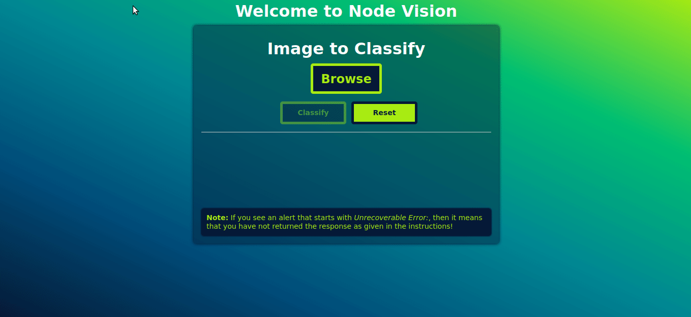

# Node Vision

This is a ExpressJS application that provides the framework on top of which you can implement multiple backends to detect labels in images.

## What is the purpose of this exercise?

The purpose of this exercise is to assess the following,
  * ability to work with an existing code
  * integrate new backends to existing code
  * attention to detail
  * code quality
  * error handling

## What you will be implementing?

You will be implementing a backend to detect label in images using *AWS Rekognition* API. You will be shared temporary AWS access keys for authenticating with the Rekognintion API.

*Optionally*, you can implement any *additional* backends of your choice, for example *Google Vision*.

## How to run the code

* You need to have *NodeJS 10.x or higher* installed
* Get the code and extract it to any directory in your system
* Switch to that directory in command prompt
* Run `npm install` to install all dependencies
* Run the app with `npm start`

## Instructions

* You will have to modify *routes/vision.js* to implement your backend code for detecting labels in images. The file will have comments to show you where your code goes.
* The file uploaded from the UI can be accessed using `req.files.file` & it will have the following properties,
  - **data** - A *JS buffer* that represent the uploaded file, returns empty buffer in case `useTempFiles` option was set to true.
  - **name** - **Example:** car.jpg.
  - **mv** - A function to move the file elsewhere on your server. Can take a callback or return a promise.
  - **mimetype** - The mimetype of your file.
  - **tempFilePath** - A path to the temporary file in case `useTempFiles` option was set to true.
  - **truncated** - A boolean that represents if the file is over the size limit.
  - **size** - Uploaded size in bytes.
  - **md5** - MD5 checksum of the uploaded file
* Once implement your backend, call it, get the response, process and return the attributes in JSON format as below,
    ```
    {
      "labels": ["shoe", "red", "nike"]
    }
    ```
* Handle any errors that occur while calling your backend or procesesing the response, set the appropriate *HTTP status code* and return the error in *JSON* format as below (might want to check out the *ExpressJS documentation!*).
    ```
    {
      "error": "Unable to process the request"
    }
    ```

**NOTE:** You would only have to modify *routes/vision.js*, *package.json* & *package-lock.json* (if you install any additional NodeJS packages).

## Sample


